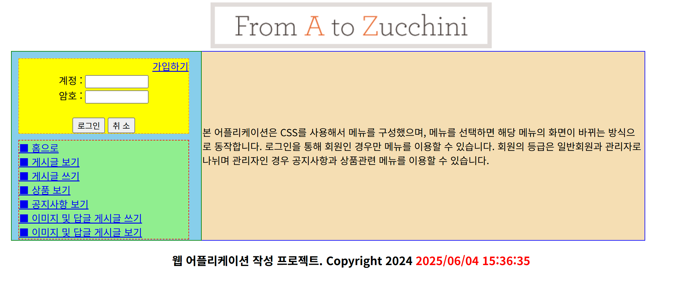
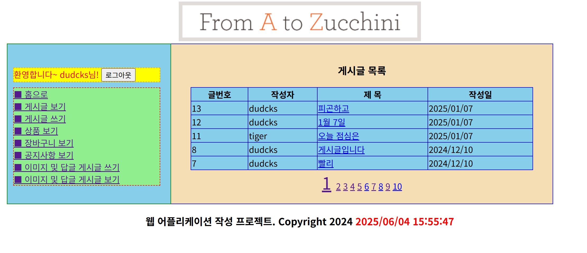
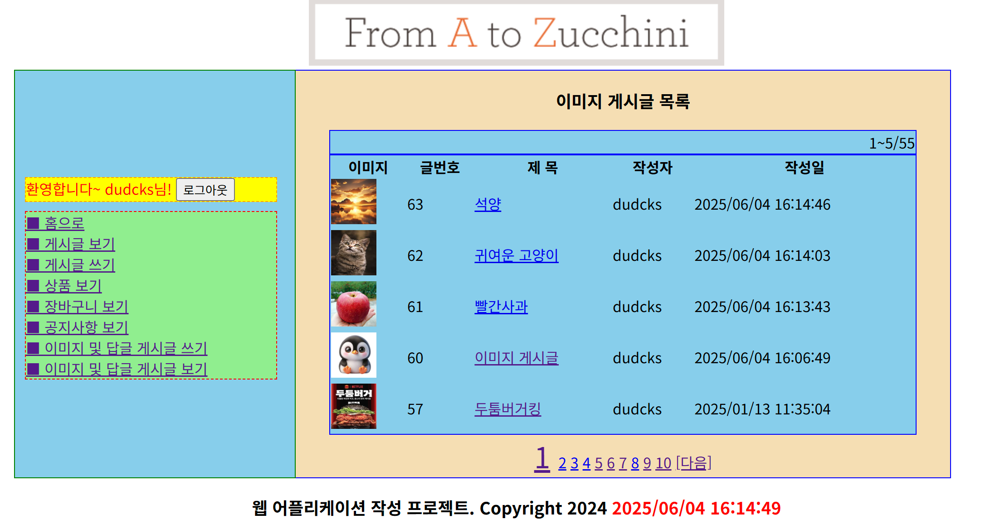
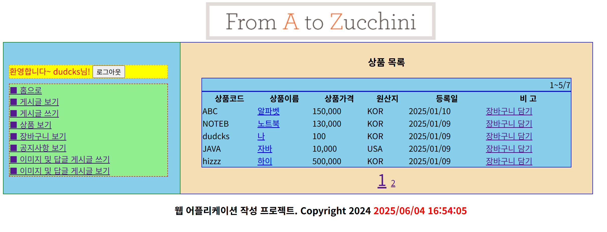
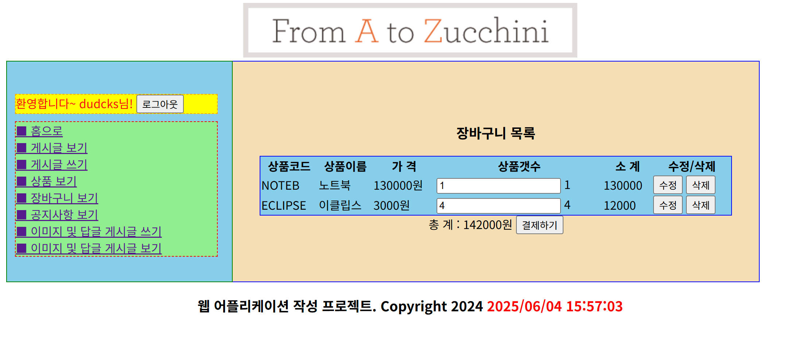
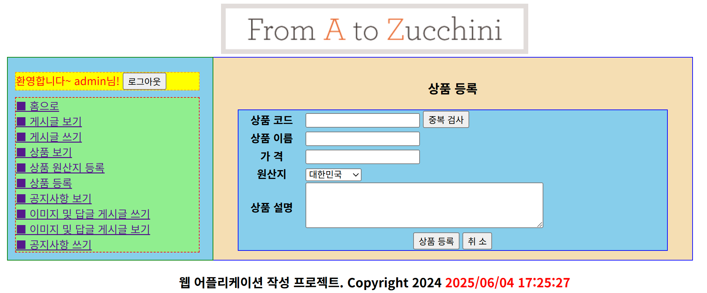

# 📋 게시판 만들기 프로젝트(개인 프로젝트)
Servlet과 JSP를 활용해 게시글 작성, 조회, 수정, 삭제 기능을 제공하는 간단한 **게시판 만들기 프로젝트**입니다. 
일반 게시판 외에도 이미지 게시판, 상품 보기 및 공지사항 기능을 포함합니다.

---

## 📌 프로젝트 개요

- **프로젝트명** : JSP/Servlet 게시판 웹앱
- **개발 기간** : 2024.11 ~ 2024.12
- **개발 환경** : Eclipse(4.30.0), JSP, Oracle
- **목표** : Servlet과 JSP를 이용한 웹 개발 학습 및 게시판 기능 구현

---

## 🛠 기술 스택

- **Backend** : Java (Servlet)
- **Frontend** : JSP, HTML/CSS, JavaScript
- **Database** : Oracle 11g
- **개발 도구** : Eclipse IDE, Apache Tomcat v9.0

---

## 🔧 사용 라이브러리

- `cos.jar` : 파일 업로드(멀티파트) 처리용 라이브러리  
- `jstl.jar` : JSP 표준 태그 라이브러리 (JSTL)  
- `standard.jar` : JSTL 실행에 필요한 표준 구현 라이브러리  
- `mybatis-3.2.8.jar` : SQL 매핑 프레임워크, DAO와 SQL 분리  
- `ojdbc.jar` : Oracle 데이터베이스 연결용 JDBC 드라이버

---

## 🔑 주요 기능

### 📃 게시판 기능

| 기능 | 설명 |
|------|------|
| 📝 일반 게시글 | 제목, 내용 입력 후 게시글 등록 가능 |
| 🖼️ 이미지 게시글 | 이미지 업로드 포함 게시글 작성 가능 |
| 📄 게시글 목록 조회 | 전체 게시글 조회 (페이징 처리 포함) |
| 🔍 게시글 상세 보기 | 게시글 제목 클릭 시 상세 정보 확인 |
| ✏️ 게시글 수정 | 본인이 작성한 게시글 수정 가능 |
| 🗑️ 게시글 삭제 | 삭제 시 확인용 비밀번호 입력 후 삭제 |

### ✅ 사용자 기능

- 회원가입, 로그인
- 게시글, 이미지 게시글 CRUD, 공지사항 확인
- 판매 상품 목록 조회 및 장바구니 담기/결제

### 🛠️ 관리자 기능

- 공지사항 작성 및 관리
- 상품, 상품 원산지 등록 및 수정

### ⚙️ 기타 기능

- 클라이언트 유효성 검사 (JavaScript)
- 기본적인 보안 처리 (입력값 검증, POST 방식 등)

---

- ## 📸 화면 사진

| 메인 페이지 | 게시글 목록 |
|-------------|--------------------|
|  |  |

| 이미지 게시글 목록 | 판매물품 목록 |
|-------------|----------------|
|  |  |

| 장바구니 | 상품 등록(관리자) |
|------------------|---------------|
|  |  |
